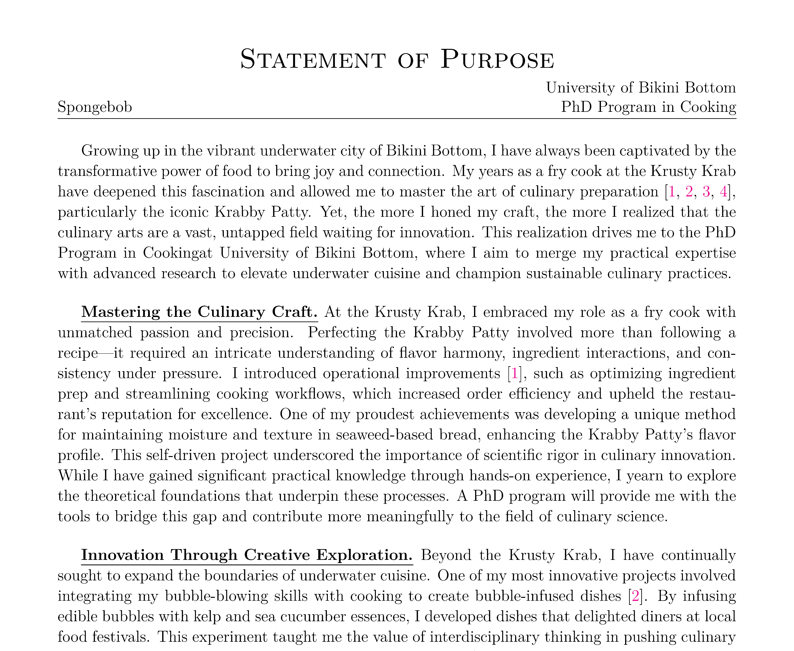

# 📄 EasierPS & EasierSoP

**EasierPS** & **EasierSoP** are enhanced versions of [EasyPS](https://github.com/salfaris/EasyPS), featuring improved display and extended functionality. This project provides simple and elegant [LaTeX](https://www.latex-project.org/get/) templates for managing Personal Statements (PS) and Statements of Purpose (SoP) across multiple graduate school applications, offering a clean and organized way for handling multiple essays.



### Table of contents

- [Installation](#installation)
- [Usage](#usage)
- [Examples](#examples)
- [New Features](#new-features)
- [Known Bugs](#known-bugs)
- [License & Disclaimer](#license--disclaimer)

## Installation

### Run on Overleaf (Recommended)

I have uploaded the templates to [Overleaf](https://www.overleaf.com/)—an online LaTeX editor. You can access them by clicking the link below:

[Open **EasierPS** & **EasierSoP** Template on Overleaf](https://www.overleaf.com/latex/templates/)

### Run Locally

If you are running the LaTeX compilation locally, you should download the `zip` file by either clicking the green **Code** button above, or clone the repository if you have [Git](https://git-scm.com/) installed:

```bash
git clone https://github.com/DaizeDong/Easier-PS-and-SoP.git
```

## Usage

The project contains two independent templates (**EasierPS** & **EasierSoP**), and you should first select the one you need. The following instructions are for **EasierSoP**, but they are also applicable to **EasierPS**.

1. Go to the `easier_sop` directory and open `main.tex`.

2. Change these variables accordingly:
   ```latex
   % --- ESSAY DISPLAY SETTINGS ---
   \SetStudentName{StudentName}           % Your name
   \SetProgramName{ProgramName}           % Program you're applying for
   \SetUniversityName{UniversityName}     % University name
   \SetUniversityAbbr{\GetUniversityName} % University abbreviation (default as the university name if not set)
   
   % --- CONTENT INPUT FILES ---
   \SetBaseContentPath{content/base}      % Name to the input file (base)
   \SetUniContentPath{content/university} % Name to the input file (university)
   ```

3. Open the `easier_sop` directory and create the `.tex` files as you inserted in the `SetBaseContentPath` and `SetUniContentPath`. Then write the different parts of your SoP in them accordingly. To reference your papers, just add the according **BibTeX** citations in `easier_sop/ref.bib`.

   > **❗[Warning]** There is a bug affecting content truncation on the first page. If your PS/SoP exceeds one page, please manually insert the command `\newpage\noindent` in the content to handle the truncation. For reference, you can check the example file `easier_sop/content/example_base.tex`.

   > **Note:** If you don't want to separate your SoP into two parts, just leave the base `.tex` file empty and write all contents in the university-specific `.tex` file.

   | File              | Content                                                                                 |
   |-------------------|-----------------------------------------------------------------------------------------|
   | `BaseContentPath` | The common part of your SoP, such as the research experiences and research interests.   |
   | `UniContentPath`  | The university-specific part of your SoP, such as the professors you want to work with. |

4. Build your `.pdf` file as usual.

## Examples

For reference, I have provided an `example.tex` file for both **EasierPS** and **EasierSoP** (generated by [ChatGPT-4o](https://chatgpt.com/), featuring the fictional character SpongeBob SquarePants). This example demonstrates how the templates work with illustrative content. You can compile these files to view the output and better organize your own file structure.

## New Features

- Added support for Statements of Purpose (SoP) in addition to Personal Statements (PS).
- Adjusted template formats for PS and SoP to meet their specific requirements.
- Organized the files into a shared `base.tex` and the university-specific `xxx.tex` for better reuse and management.
- Included detailed annotations for easy understanding and customization.
- Enhanced the display with improvements in fonts, titles, and references.

## Known Bugs

> **❗[Warning]** This is a known issue with the current template. Please use the workaround to handle truncation (by manually adding `\newpage\noindent`) until the issue is resolved.

Due to the placement of the title within the header on the first page, I encountered some issues that I’ve tried my best but couldn't solve:

- The content on the first page is not truncated when the PS/SoP exceeds one page.
- The page number in the footer does not appear on the first page.

These issues are caused by the following code (using `easier_sop.cls` as an example):

```latex
\fancypagestyle{firstpageheader}{
    ...
    \fancyhead[C]{
        \centering {\LARGE \textsc{Statement of Purpose}} \\ [0.35em] % Larger font for the title
        \makebox[\textwidth][r]{\@UniversityName} \\ % University Name on the right
        \makebox[\textwidth][l]{\@StudentName \hfill \@ProgramName} % Student Name and Program Name aligned
        \vspace{-14pt} % Adjust vertical space between elements
    }
    ...
}
```

If you have any potential solutions, please feel free to open a pull request and contact me. Thank you!

## License & Disclaimer

### License

This project is licensed under the [**BSD-3-Clause License**](https://opensource.org/license/BSD-3-clause). Redistribution and use in source and binary forms, with or without modification, are permitted provided that the following conditions are met:

1. Redistributions of source code must retain the above copyright notice, this list of conditions and the following disclaimer.

2. Redistributions in binary form must reproduce the above copyright notice, this list of conditions and the following disclaimer in the documentation and/or other materials provided with the distribution.

3. Neither the name of the copyright holder nor the names of its contributors may be used to endorse or promote products derived from this software without specific prior written permission.

### Disclaimer

This project is intended for educational purposes only. The use of characters such as SpongeBob SquarePants and Mr. Krabs in examples is for parody and illustrative purposes only. This work is not affiliated with or endorsed by ViacomCBS (now Paramount Global) or any official creators of the SpongeBob SquarePants franchise. No commercial use or profit is derived from this project.
